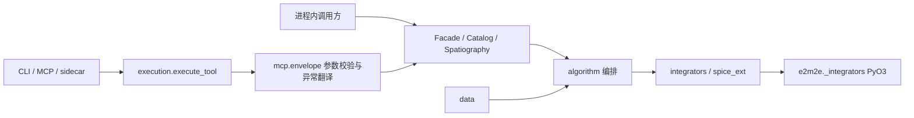

# Repository Guidelines

本指南面向 AI 助手与贡献者，记录当前代码、构建和验证契约。先读本文件、`CONTEXT.md` 与相关 ADR，再改动；以源码和配置为准，不以旧文档中的工具数量或版本示例为准。

## Project Overview

`e2m2e`（Earth to Moon, Moon to Earth）是地月空间算法工具集，覆盖 CR3BP 任务轨道与轨道族、星历传播、转移设计、轨道保持、时空坐标转换、轨道库和地月空间分区分析。Python API 编排领域逻辑，Rust/PyO3 扩展 `e2m2e._integrators` 承担数值密集路径。

调用方入口：

- 进程内：`from e2m2e.api import Facade`，并通过 `Facade().catalog`、`Facade().spatiography` 使用轨道库和分区能力。
- CLI：`e2m2e <工具名>`；部署命令为 `e2m2e mcp-serve` 和 `e2m2e serve-stdio`。
- MCP 与 GUI sidecar 的工具面、请求模型和描述均从同一接口元数据派生。

## Architecture & Data Flow

### 分层与依赖方向

源码由底至顶为：

1. `e2m2e/data/`：常数、SPICE 内核、帧数据、模板、通用类型和轨道库。
2. `crates/` 数值层：传播、力模型、SPICE FFI、水平集/HJB，以及 `e2m2e._integrators` 的 PyO3 绑定。
3. `e2m2e/algorithm/`：构造领域问题、选择轨道族和约束、调用数值后端、解释结果。
4. `e2m2e/api/`：Facade、Catalog、Spatiography、Pydantic 边界和传输适配器。
5. `e2m2e/tools/`：日志等辅助能力。

`e2m2e/mbse/` 是独立的系统工程模型子系统，不属于上述调用链。包根的 `exceptions.py`、`status.py`、`spice_ext.py`、`integrators.py` 是共享叶模块，不得导入任何业务层。

硬门禁在 `scripts/check_layer_imports.py`：`data` 不得依赖 `algorithm/api/tools/integrators/mbse`，`algorithm` 不得依赖 `api/tools/mbse`，`api` 不得依赖 `tools/mbse`。新增 import 前先检查这一边界。

算法层通常由 Python 构造和编排问题，积分、力模型、族生成、打靶和搜索等性能敏感路径下沉 Rust；仓库仍保留显式选择的 SciPy 路径，不要把“Rust 快速路径”误改成无条件替换。Rust 扩展要求在使用处校验 ABI 和符号，缺失时抛错，不得静默回退到 Python/scipy。

### 工具执行链



- `e2m2e/api/facade.py` 的 `mcp_exposed`、`tool_inventory` 和 `resolve_tool_method` 是工具元数据唯一来源。MCP、CLI、sidecar 不得维护第二份工具清单或手写工具数量；描述取方法 docstring 首行。
- `e2m2e/api/execution.py::execute_tool` 是传输层工具调用的共享执行核心：规格查找、Pydantic 校验、调用、错误翻译和可选二进制帧抽取都在这里统一。进程内 API 仍可直接调用暴露类方法。
- `transfer_design`、`orbit_family_generation` 属于长任务，MCP/CLI/sidecar 经 `e2m2e.api.mcp.worker` 子进程执行；取消通过 kill 子进程，不要试图在线程中强行终止 Rust 计算。
- 统一文本信封为 `{status, data, error, meta}`。sidecar 的大数组使用 `e2m2e/api/frames.py` 唯一实现的 `E2M2` 帧，支持 `f32`/`f64`；不要在传输适配器中复制帧编码逻辑。

## Key Directories

| 路径 | 用途 |
|---|---|
| `e2m2e/data/` | 常数、内核、帧、模板、类型、catalog；`constants/constants.toml` 是物理常量源文件 |
| `e2m2e/algorithm/` | design、family、dynamics、forces、solver、transfer、coordinate、manifold、station_keeping、spatiography 等编排 |
| `e2m2e/api/` | `facade.py`、`models.py`、`execution.py`、MCP、CLI、sidecar 和配置 |
| `e2m2e/tools/` | 日志等辅助工具 |
| `e2m2e/mbse/` | 独立的需求、架构、数据和图表模型 |
| `crates/` | Rust workspace；`crates/cspice/` 是 `[patch.crates-io]` vendor crate，不是 workspace member |
| `tests/` | 按 data、numerical、algorithm、api、tools、mbse、`_meta` 镜像分层 |
| `scripts/` | 构建资源下载、架构检查、基线生成、benchmark 和手工诊断 |
| `docs/adr/` | 不可静默覆盖的架构决策记录；`CONTEXT.md` 是唯一领域术语表 |
| `kernels/` | 运行期 SPICE 内核；大型 `.bsp` 由 Git LFS 或 `download_kernels.py` 管理 |
| `e2m2e/data/catalog_baseline/` | 回归夹具和 Release 资产源，不随 wheel 分发，须显式导入 |

## Development Commands

源码开发使用 Makefile，不要手工拼接 editable 构建：

```bash
make dev            # setup + uv sync --group dev --no-install-project + maturin develop
make dev-release    # 同上，Rust 扩展以 --release 构建
make setup          # 下载 CSPICE 编译包和 SPICE 内核
make cspice         # 只准备 CSPICE_DIR
make kernels        # 只准备 kernels/
make test           # Rust workspace + Python 全量测试
make test-python    # pytest，默认 -n auto --dist loadscope
make test-rust      # cargo test --workspace，串行运行
make check          # fmt、clippy、ruff、层级/旧路径检查、mypy
make fmt            # Rust/Python 就地格式化
make docs           # Sphinx 零告警构建到 docs/_build/html
make catalog-baseline
make clean-tests
```

重要约束：

- 禁止裸跑 `uv sync`；它会触发 editable Rust 扩展构建并与 `make dev` 重复。`uv run` 一律带 `--no-sync`，例如 `uv run --no-sync python -m pytest ...`。
- 定向验证示例：`uv run --no-sync python -m pytest tests/api/test_cli.py::TestWorker::test_cancel`、`uv run --no-sync python -m pytest tests/algorithm -m "not spice"`、`cargo test -p e2m2e-forces srp_jacobian -- --test-threads=1`。
- 基线生成和回填脚本的 docstring 要求直接使用 `.venv/bin/python`，不要用会触发项目重建的 `uv run`：`.venv/bin/python scripts/generate_catalog_baseline.py`。
- 文档工具未随 dev group 安装时，先在虚拟环境安装 `sphinx myst-parser sphinx-autoapi shibuya`，再运行 `make docs`。文档构建不需要安装项目本体、Rust 或 SPICE。
- `make check` 是本地静态总门禁；PR CI 分为 `lint` 与 `typecheck`，不代替本地 Python 全量测试。修改 Makefile 或 CI 命令时同步检查两者。

## Code Conventions & Common Patterns

- Python 用 ruff：100 列、`target-version = "py310"`，规则集为 `E F W I UP B SIM`；Rust 用 `cargo fmt` 和 `cargo clippy --workspace -- -D warnings`；类型检查为 `mypy e2m2e/ --ignore-missing-imports`。
- Python 模块、函数和变量用 `snake_case`，类用 PascalCase；公共模块维护显式 `__all__`。请求/响应成对命名为 `*Request`/`*Response`；错误码用大写下划线。Rust FFI 函数通常以 `*_py` 命名，SPICE 包装以 `spice_*` 命名，但以实际导出表为准，不要强行重命名所有非 `*_py` 符号。
- 新的公开输入输出模型放 `e2m2e/api/models.py`，继承公共 API 模型并保持 `extra="forbid"`；算法层使用 numpy、dataclass 和领域类型，不把 Pydantic 边界下沉到算法/data。字段描述是 CLI `--help` 和 MCP schema 的权威来源。
- 确定性错误使用 `E2M2EError` 层次；不可行搜索或部分成功使用 `(ConvergenceState, FailureCause, message)` 状态三元组，不用异常伪装软失败。API 信封将参数校验映射为 `INVALID_PARAMS`，保留领域 `OrbitError`，`E2M2EError` 层次映射为 `E2M2E_ERROR` 并保留 message（确定性领域错误的 cause 不丢），其余异常映射为 `INTERNAL_ERROR` 且不泄露 traceback。
- 核心同步；异步只放传输层。MCP 短任务用 `anyio.to_thread`，长任务用 worker 进程；进度回调形状为 `cb(fraction, message)`，进度回调失败不得中断计算。Rust 长计算用 `py.allow_threads`，可用 Rayon 并行。
- 通过 `Config` 注入运行环境，不新增全局单例。`Config.to_payload/from_payload` 是 worker 跨进程契约，未知字段必须拒绝。catalog 的 `records/*.json + *.npz` 是事实来源，`catalog.db` 是可重建索引；目录配置和自动入库都必须由调用方显式开启。
- 物理常量只改 `e2m2e/data/constants/constants.toml`，让 Python loader 和 Rust build script 同步生成；动力学基准使用研究级容差，筛选和测试使用筛选级容差，不把长弧/密网格塞入默认 pytest。
- 新增工具的顺序是：算法实现 → `Facade`/`Catalog`/`Spatiography` 方法加 `@mcp_exposed(request_model=...)` → 检查 `tool_inventory()` 派生面 → 补接口行为测试。不要在 MCP、CLI、sidecar 中复制业务逻辑。
- 注释、docstring、commit、Issue、PR 和 Agent brief 用中文；面向调用方的行为变化更新 `CHANGELOG.md`。ADR 是决策快照，后续变化追加修订或新开递增 ADR，不改写历史结论。

## Important Files

- 组合根与入口：`e2m2e/__init__.py`、`e2m2e/api/facade.py`、`e2m2e/api/cli/main.py`、`e2m2e/api/mcp/server.py`、`e2m2e/api/sidecar/__init__.py`。
- API 契约：`e2m2e/api/models.py`、`e2m2e/api/config.py`、`e2m2e/api/execution.py`、`e2m2e/api/mcp/envelope.py`、`e2m2e/api/frames.py`、`e2m2e/api/mcp/worker.py`。
- 共享内核：`e2m2e/exceptions.py`、`e2m2e/status.py`、`e2m2e/integrators.py`、`e2m2e/spice_ext.py`。
- 领域实现：`e2m2e/algorithm/design/design_orbit.py`、`algorithm/family/__init__.py`、`algorithm/dynamics/`、`algorithm/forces/`、`algorithm/transfer/`；数据和 catalog 在 `e2m2e/data/`。
- Python↔Rust 边界：`crates/e2m2e-integrators/src/lib.rs`、`crates/e2m2e-integrators/build.rs`、`crates/e2m2e-integrators/abi-version.txt`、各 crate 的 `Cargo.toml`。
- 构建与版本：`pyproject.toml`、`Cargo.toml`、`Makefile`、`rust-toolchain.toml`、`.python-version`、`uv.lock`、`Cargo.lock`（若存在，仅以配置和版本锁为准）。
- 门禁与测试基础设施：`scripts/check_layer_imports.py`、`scripts/check_deleted_dir_refs.py`、`tests/conftest.py`、`tests/time_budget.py`、`tests/kernel_helpers.py`、`tests/_meta/`。
- 维护规则：`README.md`、`CONTRIBUTING.md`、`CONTEXT.md`、`CHANGELOG.md`、`docs/adr/README.md`、`docs/agents/issue-tracker.md`、`docs/agents/multi-session-concurrency.md`。

## Runtime/Tooling Preferences

- 运行时最低 Python `>=3.10`，开发环境由 `.python-version` 固定为 3.13；Rust 由 `rust-toolchain.toml` 固定为 1.98.0，并要求 rustfmt/clippy。包管理使用 uv，锁文件为 `uv.lock`；Python↔Rust 构建使用 maturin。
- 本地不需要 Node、Bun 或 Docker。CI 的 manylinux wheel job 使用容器是发布实现细节，不改变本地 `make dev` 流程。
- 普通构建的 CSPICE 来自 GitHub Release `cspice-v1`，SPICE 内核来自 `kernels-v1`；不要启用 `cspice-sys` 的官网下载路径。`make` 自动准备 `CSPICE_DIR`，bindgen 需要 `LIBCLANG_PATH`。支持的平台和资产规则以 `scripts/download_cspice.py` 为准。
- Rust 扩展缺失、ABI 过期或符号缺失时应明确报错并提示 `make dev`，不得静默降级。`crates/e2m2e-integrators/abi-version.txt`、生成的 `e2m2e/_rust_abi.py` 与 Rust `_py_abi_version()` 必须保持一致。
- 运行时常用配置为 `SPICE_KERNEL_DIR`、`E2M2E_CATALOG_DIR`、`E2M2E_CATALOG_ENABLED`；并行度和测试线程环境变量应遵循 Makefile、Rust 入口及 `tests/conftest.py` 的现有命名，不自行引入同义开关。
- 可选依赖按功能安装：`[mcp]` 提供 MCP/anyio，`[normal-form]` 提供 SymPy，`[docs]` 提供 Sphinx 文档工具。新增依赖前先复用标准库或现有依赖，并同步 `pyproject.toml` 与 `uv.lock`；Rust 依赖统一放 workspace。

## Testing & QA

- Python 使用 pytest、pytest-xdist、pytest-cov；Rust 使用 `cargo test`，测试既有 crate 内 `#[cfg(test)]` 也有 `crates/*/tests/` 集成测试。Rust 全量测试必须 `--test-threads=1`，因为 CSPICE 有进程级全局状态。
- 每个 pytest 用例恰好一个主功能标记：`theory`、`integrator`、`force`、`data`、`orchestration`、`interface`、`aux`；`spice`、`low_thrust` 是正交标记。不要新增 `slow`、`e2e` 等速度层标记，也不要让一个用例承担多个主类。
- 缺少外部能力才 skip：使用 `requires_spice`、`requires_native_symbols`、`pytest.importorskip` 或现有 fixture；代码错误必须 fail。SPICE fixture 用完卸载内核，catalog 测试用 `tmp_path` 隔离目录，昂贵轨道用 session/module 缓存并在函数级返回副本。
- 时间门禁机器强制 call 阶段默认每用例 10 秒；确实无法压缩时才用 `@pytest.mark.time_budget(seconds)` 并写明原因。单文件 60 秒是人工纪律，不是当前插件的机器门禁；长弧、密网格和生产图移到 `scripts/`。
- 按物理定义、解析解、守恒量、对称性和文献公式验收；不把外部软件运行时输出当 oracle。协议字节、闭式公式等固定值可以验证，但不要用脆弱的实现细节或复制同一实现的断言替代行为测试。
- Python 覆盖率配置为 branch coverage、`fail_under = 55`，需显式运行 `uv run --no-sync python -m pytest --cov` 才启用；`make test` 本身不带 `--cov`。修改行为时先补最小真实调用或回归测试，并运行受影响测试、`make check`；跨层契约变化再扩大到 `make test`。
- `_meta` 测试守护主标记、层级相关契约、常量来源、Rust ABI、共享叶 re-export、原生符号门和测试残留。`make check` 不会自动运行 `_meta`，完整 pytest 收集时才会覆盖这些门禁。
