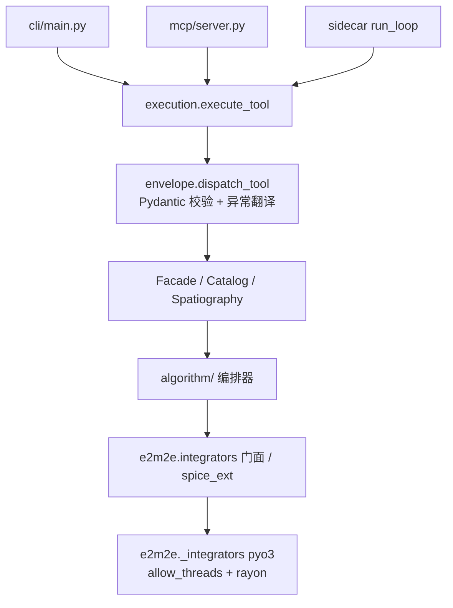

# AGENTS.md

e2m2e（Earth to Moon, Moon to Earth）仓库的开发导则。给 AI 助手与贡献者：先看 “Architecture & Data Flow” 与 “Development Commands”，改动前遵守 “Code Conventions” 与 “Testing & QA”。

## Project Overview

地月空间算法工具集：CR3BP 转移轨道设计、任务轨道设计与保持、轨道预报、时空坐标转换、轨道库与地月空间分区分析。Python 包 `e2m2e`（v5.9.5，Apache-2.0）+ Rust 数值内核（PyO3/maturin 单扩展 `e2m2e._integrators`）。对外三条调用链：进程内 import、MCP（`e2m2e mcp-serve`）、CLI（`e2m2e`），GUI 经 sidecar stdio 协议（`e2m2e serve-stdio`）。

## Architecture & Data Flow

五层架构（ADR 0011/0012/0039），自底向上严格单向依赖，由 `scripts/check_layer_imports.py`（`make check` 一步）硬门禁：

1. `e2m2e/data/`：常数、星历、坐标系数据、类型与模板、轨道库存储
2. `crates/`（Rust）：数值层——积分器、力模型、SPICE FFI、水平集/HJB
3. `e2m2e/algorithm/`：动力学与力模型编排、轨道族、微分修正、转移、spatiography
4. `e2m2e/api/`：Facade / Catalog / Spatiography 暴露类 + MCP/CLI/sidecar
5. `e2m2e/tools/`：日志等辅助

`e2m2e/mbse/` 是独立顶层子系统（系统工程模型与需求追溯），在依赖链之外。包根 `exceptions.py` / `status.py` / `spice_ext.py` / `integrators.py` 是共享内核叶，不得 import 任何层。

接口面（ADR 0043）：三个暴露类承载 `@mcp_exposed` 元数据——`Facade`（任务级：design_orbit / control_orbit / transfer_design / orbit_propagation / spacetime_transform / valid_ranges）、`Catalog`（轨道库 + 族生成，8 方法）、`Spatiography`（分区分析，5 方法）。`tool_inventory(Facade())` 是工具面唯一清单，MCP（`api/mcp/tools.py`）、CLI（`api/cli/main.py`）、sidecar 全部纯派生自它，无生成文件。工具 description 取 docstring 首行。



- 执行核心 `e2m2e/api/execution.py::execute_tool` 是唯一执行入口（#601），传输层只是薄适配器。长任务（`transfer_design`、`orbit_family_generation`）走 `python -m e2m2e.api.mcp.worker` 子进程，取消 = kill。
- 跨模块契约集中在：统一信封 `{status,data,error,meta}`（`api/mcp/envelope.py`）、每工具一对 `*Request/*Response`（`api/models.py`，`extra="forbid"` 全手写）、状态三元组 `(ConvergenceState, FailureCause, message)`（`e2m2e/status.py`）、二进制帧（`api/frames.py` 唯一实现，magic `E2M2`）、跨进程 `Config.to_payload/from_payload`、Python↔Rust ABI（`crates/e2m2e-integrators/abi-version.txt` ↔ `_py_abi_version()`）。
- SPICE 双实例桥（ADR 0016）：Python spiceypy 与 Rust cspice 各持内核池，桥接只经 `e2m2e/spice_ext.py`。

## Key Directories

| 路径 | 用途 |
|---|---|
| `e2m2e/data/` | constants（`constants.toml` 单一来源）、kernels、frames、types、templates、catalog |
| `e2m2e/algorithm/` | 编排层：design、family、transfer、station_keeping、dynamics、forces、solver、spatiography、normal_form、coordinate 等 |
| `e2m2e/api/` | 接口层：facade、catalog、spatiography、models、execution、config、frames、mcp/、cli/、sidecar/ |
| `crates/` | Rust workspace：e2m2e-integrators（绑定）、-propagation、-forces、-spice、-levelset、-hjb-dynamics；`crates/cspice` 为 vendor patch（非 member） |
| `tests/` | 镜像源码分层：data / numerical / algorithm / api / tools / mbse / `_meta`（架构守门） |
| `scripts/` | 开发辅助：数据下载、门禁检查、数据集生成、基准、Colab 搬运 |
| `docs/adr/` | 架构决策记录 0001–0047（0043 起中文） |
| `kernels/`、`e2m2e/data/catalog_baseline/` | 数据资产：SPICE 内核（`make kernels` 拉取）、CR3BP 基线数据集（不随包分发，ADR 0047） |

## Development Commands

```bash
make dev            # 唯一开发入口：setup + uv sync + maturin develop（debug）
make test           # 全量：Rust 工作区 + Python
make test-python    # pytest tests/ -n auto --dist loadscope
make test-rust      # cargo test --workspace -- --test-threads=1
make check          # 格式 + lint + 类型/层级检查（与 ci.yml 逐条对齐）
make fmt            # 就地格式化（cargo fmt + ruff format + ruff check --fix）
make setup          # 首次拉取 CSPICE 编译包 + SPICE 内核
```

- **切勿裸跑 `uv sync`**（editable 触发扩展构建、与 make dev 重复，#478）；`uv run` 一律带 `--no-sync`。
- 单跑示例：`uv run --no-sync python -m pytest tests/api/test_cli.py::TestWorker::test_cancel`、`uv run --no-sync python -m pytest tests/algorithm -m "not spice"`、`cargo test -p e2m2e-forces srp_jacobian -- --test-threads=1`。
- `scripts/generate_catalog_baseline.py` / `backfill_baseline_taxonomy.py` 用 `.venv/bin/python` 直跑，不用 `uv run`（docstring 明示）。
- `make check` 与 `.github/workflows/ci.yml` 命令须保持对齐：CI 不调 make，改任一边同步另一边。

## Code Conventions & Common Patterns

- **格式**：ruff（`line-length = 100`，`target-version = "py310"`，select `E,F,W,I,UP,B,SIM`）+ `cargo fmt`（默认风格）+ `cargo clippy -D warnings` + `mypy e2m2e/ --ignore-missing-imports`。别引入它们之外的格式化风格。
- **命名**：Python 模块/函数 `snake_case`、类 PascalCase（`CR3BP_System` 为例外保留名）、模块显式 `__all__`、私有 `_` 前缀；每工具 `*Request`/`*Response` 成对；错误码 SCREAMING_SNAKE 字符串（`INVALID_PARAMS` / `TOOL_NOT_FOUND` / `WORKER_CRASHED` / `INTERNAL_ERROR`）。Rust FFI 入口 `*_py` 后缀（`propagate_cr3bp_py`）、SPICE 包装 `spice_*` 前缀、结果 pyclass `*Result`（`#[pyclass(frozen, get_all)]`）。
- **错误处理**（ADR 0020/0024）：确定性失败抛异常（`E2M2EError` 层次，`exceptions.py`）；不可行搜索不抛异常，返回状态三元组（`status.py`）；禁止隐式降级——Rust 扩展缺失抛 `RustExtensionUnavailableError`，绝不静默回退 Python/scipy。api 边界统一翻译：`OrbitError` → 原 code，Pydantic `ValidationError` → `INVALID_PARAMS`，其余 → `INTERNAL_ERROR` 且不泄 traceback。
- **异步**：核心全同步；async 只在 MCP 传输层（anyio，短任务 `to_thread.run_sync`，长任务 `open_process`）。Rust 长计算 `py.allow_threads` 释放 GIL + rayon 并行，环境开关 `E2M2E_*_PARALLEL`。进度回调形状 `cb(fraction, message)`，回调异常吞掉不中断计算。
- **依赖注入 / 状态**：`Config`（`api/config.py`）构造注入 Facade，环境变量取默认（`SPICE_KERNEL_DIR`、`E2M2E_CATALOG_DIR`、`E2M2E_CATALOG_ENABLED` 等）；无全局单例。轨道库 `records/*.json+*.npz` 为事实来源、`catalog.db` SQLite 为派生索引，逐记录原子写；catalog 默认关，入库是调用方显式决定（ADR 0045/0047）。
- **Pydantic 边界**：Pydantic 只出现在 `e2m2e/api/`；算法层用 numpy/dataclass，保留细粒度 API。
- **新增 MCP 工具**：algorithm 层实现 → 暴露类方法加 `@mcp_exposed(request_model=…)` → 工具清单自动派生（MCP/CLI/sidecar 同步）→ 钉工具数的 `tests/api/test_facade.py` 更新 → `make check`。工具面数量以跑 `tool_inventory()` 报告为准，不从文档引用（ADR 0043）。
- **物理常量**：单一来源 `e2m2e/data/constants/constants.toml`（build.rs 生成 Rust const，`constant_value_py` 同源核对）。容差分两档：研究级 `1e-12`（动力学基准）vs 筛选级 `1e-9~1e-10`（网格筛选、测试套件）。
- 注释、docstring、commit message、issue/PR 一律中文（详见下文 “交流语言”）。

## Important Files

- 入口：`e2m2e/api/cli/main.py`（CLI，console script `e2m2e`）、`e2m2e/api/mcp/server.py::create_server`、`e2m2e/api/mcp/worker.py`（长任务子进程）、`e2m2e/api/sidecar/__init__.py::run_loop`、`crates/e2m2e-integrators/src/lib.rs` 的 `#[pymodule] _integrators`
- 配置：`pyproject.toml`（构建/lint/pytest/coverage/依赖全在此）、`Cargo.toml`（workspace）、`Makefile`、`rust-toolchain.toml`（Rust 1.98.0）、`.python-version`（3.13）、`uv.lock`
- 契约与关键模块：`e2m2e/api/facade.py`（`mcp_exposed`、`tool_inventory`、组合根）、`e2m2e/api/execution.py`、`e2m2e/api/models.py`、`e2m2e/api/frames.py`、`e2m2e/status.py`、`e2m2e/exceptions.py`、`e2m2e/spice_ext.py`、`e2m2e/integrators.py`（数值层门面）
- 流程文档：`CONTEXT.md`（术语表，唯一 glossary）、`CONTRIBUTING.md`、`docs/adr/`（架构决策权威）、`CHANGELOG.md`（面向调用方，已发布条目不可变）

## Runtime & Tooling Preferences

- **运行时**：Python `>=3.10`（开发/CI 用 3.13）；Rust 钉死 1.98.0（`rust-toolchain.toml`）。无 Node/Bun/Docker。
- **包管理**：uv（`uv.lock` 入库为锁真理；`Cargo.lock` 不入库）。Python-Rust 构建用 maturin（`features = ["spice", "extension-module"]`，后者仅 cdylib 构建启用、`cargo test` 不启用）。
- **构建前置**：`CSPICE_DIR`（`scripts/download_cspice.py` 供预编译包，禁走 NAIF 官网下载）、`LIBCLANG_PATH`（bindgen）。Makefile 自动导出。
- **Windows 一等公民**：`make PYTHON=python` 覆盖解释器；mypy/pytest 一律 `python -m` 调用（uv 垫片 trampoline 问题）；`cargo test` 需 `python3.dll` 在 PATH（Makefile 内置处理）。
- **加依赖**：先问现有库/标准库能否做；Python 运行时依赖进 `[project].dependencies`，可重依赖拆 optional 组惰性导入（`normal-form`/`mcp` 模式）；Rust 依赖版本统一进 `[workspace.dependencies]`；变更须说明理由。
- **CI**：`ci.yml` = lint + typecheck（PR 门禁）；测试不进 CI——`release.yml`（tag `v*`）跑 `cargo test`，Python 全量套件本地跑、发布前人工全量回归（ADR 0021/0037）。

## Testing & QA

- **框架**：pytest 9 + pytest-xdist + pytest-cov（无 pytest-timeout/hypothesis/pytest-mock；mock 用内置 `monkeypatch`）；Rust 用 `cargo test`（内联 `#[cfg(test)]` + `crates/*/tests/`）。
- **组织**：`tests/` 镜像源码分层；每个用例**恰好一个**功能类主标记（`theory`/`integrator`/`force`/`data`/`orchestration`/`interface`/`aux`），`spice`/`low_thrust` 正交叠加；`tests/_meta/test_functional_marker_conservation.py` 守门。不按速度快慢分层（无 slow/e2e）。
- **时间预算**（ADR 0037）：单用例 ≤10s（call 阶段，`tests/time_budget.py` 机器强制，`@pytest.mark.time_budget(<秒>)` 豁免须注释依据）、单文件 ≤60s（人工纪律）。超预算压规模（小振幅/短弧/粗网格/筛选用容差），不可压的移出 pytest 到 `scripts/`。
- **断言口径**（ADR 0013）：按物理定义验收（解析解、守恒量、对称性、文献公式）；禁 golden-file 对比、禁与外部软件运行时输出对拍。mock 只用于批边界胶水、失败语义钉子（如 Rust 符号缺失须上抛不回退）、进程生命周期（fake worker）。
- **惯例**：环境能力缺失 → skip（`requires_spice`、`requires_native_symbols`），代码错误 → fail；昂贵计算用 module-scope fixture / `functools.cache` 共享，禁止测试体内重复生成；临时文件用 `tmp_path`；容差用筛选级。
- **覆盖**：`coverage fail_under=55`（branch coverage）；无 make/CI 入口，手动 `uv run --no-sync python -m pytest --cov`。
- **验证分层**：先跑受影响模块测试 + `make check`；跨模块、共享契约、影响不明 → `make test` 全量。修 bug 先写复现测试（红→修→绿）并保留为回归测试。

---

以下为写作与编码的存量约定，全部适用。

## 写作要求

所有面向人读的文本（注释、CONTEXT.md、ADR、issue 评论、PR 描述、agent brief、triage notes、Sphinx 文档、Agent 回复）应当：

- 准确、清楚、简洁；先理解材料，再提炼结论。
- 按逻辑组织，区分相近概念；不用空泛、夸大的修饰语。
- 面向实际读者，从已知事实推到陌生结论；用分析说服，不装腔或堆砌。
- 全仓库文档不得使用直角引号「」，引号用弯引号（“”）。

## 编码准则

- **先理解再改动**：完整阅读目标文件、相似实现和相关测试；不确定 API 或惯例时查源码或文档，不猜。
- **明确目标与决策**：需求或验收条件不明确时先澄清；架构选择、假设和关键取舍要说明。
- **保持简单**：只实现当前需求。复用已有模式；不为单一用例过早抽象、配置化或引入依赖。
- **精准修改**：只改与任务直接相关的代码，贴合既有风格；删掉本次修改产生的废弃代码，不重格式化无关内容。
- **完整迁移**：变更接口或行为时更新所有调用方、测试和文档；不保留无需求的兼容层。
- **按根因修复**：先复现并读完整错误信息；一次处理一个原因，不用吞异常或特判掩盖问题。
- **验证行为**：按影响范围运行相关检查；测试可观察行为、边界和错误路径，不测试实现细节。无法测试时说明原因并做可行的烟雾验证。
- **审慎依赖**：优先现有依赖和标准库；新增依赖前确认必要性、维护状态和成本，并说明理由。
- **清楚沟通**：说明做了什么、为什么、验证结果和已知风险；对不确定性给出具体事实，提交信息描述实际改动。

## 交流语言

始终使用中文与用户交流。代码、commit message、PR 描述等技术输出也用中文。
